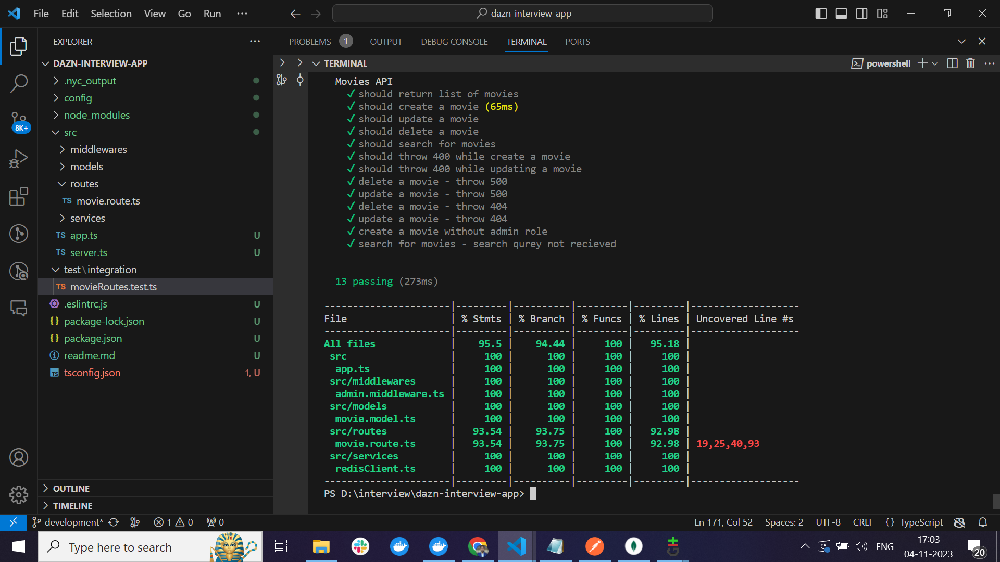

## Steps to setup and run the application
* git clone https://github.com/prasad4491/dazn-interview-app.git
* npm install
* npm run start 

## To run the testcases
* npm run test

## APIs
### 1. Create Movie API - POST /movies
```
  Request:
    URL: http://localhost:3000/movies
    Method: POST
    Headers:
      role: admin
      Content-Type: application/json
    Payload: 
      {
        "title": "comedymovie",
        "genere": "comedy",
        "rating": 5,
        "streamingLink": "http://movies.io/movie1"
      }
  Response:
    status: 201
    response:
      {
          "title": "comedymovie",
          "genere": "comedy",
          "streamingLink": "http://movies.io/movie1",
          "rating": 5,
          "_id": "65461ca45e467b5708ca9475",
          "__v": 0
      }

    status: 500
    response: {"error": "Error in creating movie"}

    status: 400
    response: {"error": "Invalid payload"}

```
**CURL**
```
  curl --location 'http://localhost:3000/movies' \
--header 'role: admin' \
--header 'Content-Type: application/json' \
--data '{
    "title": "comedymovie",
    "genere": "comedy",
    "rating": 5,
    "streamingLink": "http://movies.io/movie1"
}'
```

### 2. Update Movie API - PUT /movies/:id
```
  Request:
    URL: http://localhost:3000/movies/:id
    Method: POST
    Headers:
      role: admin
      Content-Type: application/json
    Payload: 
      {
        "title": "actionmovie",
        "genere": "action",
        "rating": 5,
        "streamingLink": "http://movies.io/movie1"
      }
  Response:
    status: 200
    response:
      {
        "_id": "65461ca45e467b5708ca9475",
        "title": "actionmovie",
        "genere": "action",
        "streamingLink": "http://movies.io/movie1",
        "rating": 5,
        "__v": 0
      }

    status: 500
    response: {"error": "Error in updating movie"}

    status: 400
    response: {"error": "Invalid payload"}

```
**CURL**
```
    curl --location --request PUT 'http://localhost:3000/movies/65461ca45e467b5708ca9475' \
  --header 'role: admin' \
  --header 'Content-Type: application/json' \
  --data '{
      "title": "actionmovie",
      "genere": "action",
      "streamingLink": "http://movies.io/movie1",
      "rating": 5
  }'
```

### 3. Get All movies - GET /movies
```
  Request:
    URL: http://localhost:3000/movies
    Method: GET
  Response:
    status: 200
    response:
      [
        {
            "_id": "65461a48d736eb6f3fe09a75",
            "title": "comedymovie",
            "genere": "comedy",
            "streamingLink": "http://movies.io/movie1",
            "rating": 5,
            "__v": 0
        },
        {
            "_id": "65461ca45e467b5708ca9475",
            "title": "actionmovie",
            "genere": "action",
            "streamingLink": "http://movies.io/movie1",
            "rating": 5,
            "__v": 0
        }
      ]

    status: 500
    response: {"error": "Error fetching movies"}

```
**CURL**
```
    curl --location 'http://localhost:3000/movies'
```

### 4. Search for a movie by title or genre - GET /search?q={query}`
```
  Request:
    URL: http://localhost:3000/search?q=movie
    Method: GET
  Response:
    status: 200
    response:
      [
        {
            "_id": "65461a48d736eb6f3fe09a75",
            "title": "comedymovie",
            "genere": "comedy",
            "streamingLink": "http://movies.io/movie1",
            "rating": 5,
            "__v": 0
        },
        {
            "_id": "65461ca45e467b5708ca9475",
            "title": "actionmovie",
            "genere": "action",
            "streamingLink": "http://movies.io/movie1",
            "rating": 5,
            "__v": 0
        }
      ]

    status: 500
    response: {"error": "Error fetching movies"}

```
**CURL**
```
    curl --location 'http://localhost:3000/search?q=movie'
```

### 5. Delete movie API - DELETE /movies/:id
```
  Request:
    URL: http://localhost:3000/movies/:id
    Method: DELETE
    Headers:
      role: admin
      Content-Type: application/json
  Response:
    status: 204
    response:

    status: 500
    response: {"error": "Error in deleting movie"}

```
**CURL**
```
 curl --location --request DELETE 'http://localhost:3000/movies/65461ca45e467b5708ca9475' \
--header 'role: admin'
```

